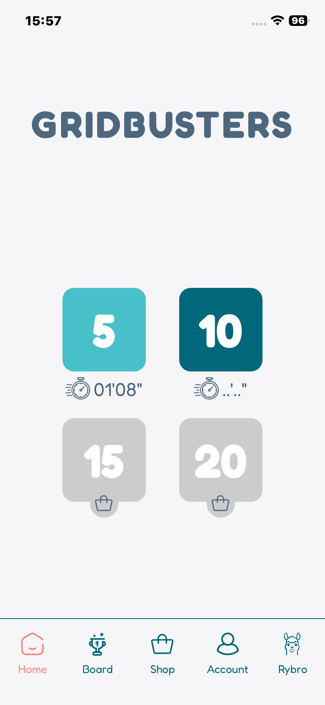
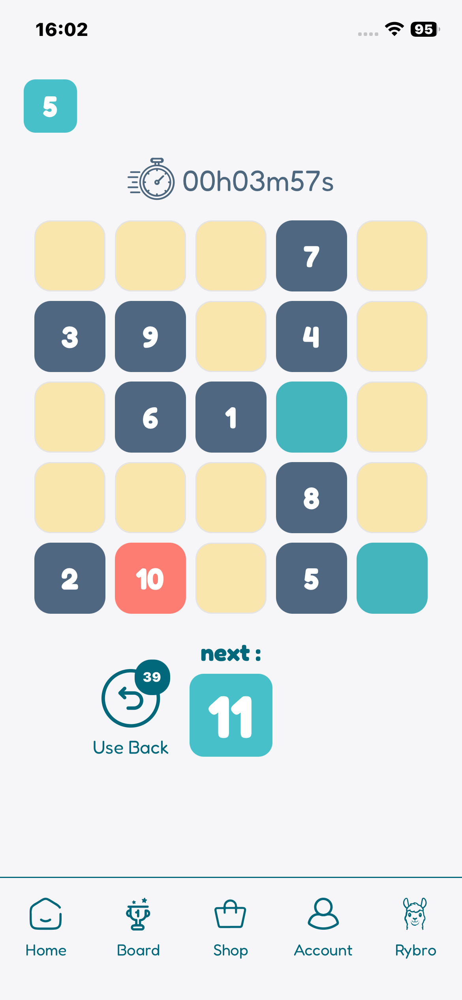

# 🎮 Gridbusters

Jeu mobile de puzzle, développé en React Native (Expo) avec Supabase en backend, disponible sur l'App Store et Google Play.

## 📱 Aperçu

 

## 🧩 Le projet

Reprise et développement complet de l'application, de l'architecture backend à la publication sur les deux stores. Intégration d'un système d'achats intégrés conforme aux exigences Apple et Google. Maquettes et prototypage réalisés sur Figma.

## 🛠️ Stack technique

- **React Native** — développement mobile cross-platform
- **Expo** — build et publication stores
- **Supabase** — backend, base de données, authentification

## 🔗 Liens

- [App Store](https://apps.apple.com/fr/app/gridbusters/id6778786355)
- [Google Play](https://play.google.com/store/apps/details?id=com.rafadevweb.Gridbusters)
- [Portfolio complet](https://moored-parade-bd3.notion.site/Portfolio-d2be2fdf133083b9b0c181154f66d020)

---

*Designs et univers graphique : Réalisation Serious Team 360°.*
